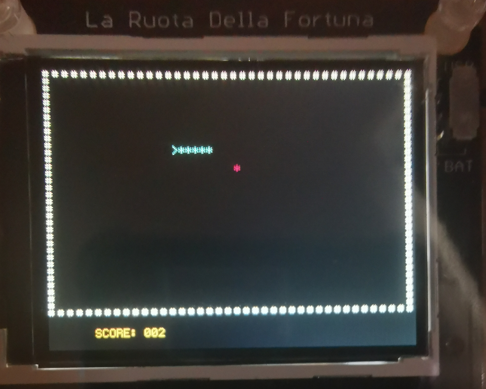

# Fortuna Snake #

The game Snake made for the LaFortuna.

## Inital Starting Screen ##

## Score Increasing ##

## Gameover Screen ##

## Installing ##
You can use the make file included to put it onto the LaFortuna board.

## How to Play ##

You can use the UP, DOWN, LEFT and RIGHT buttons on the rotary encoder to change the snakes direction.

## License ##

* lcd
    * Author: Steve Gunn
    * Licence: Creative Commons